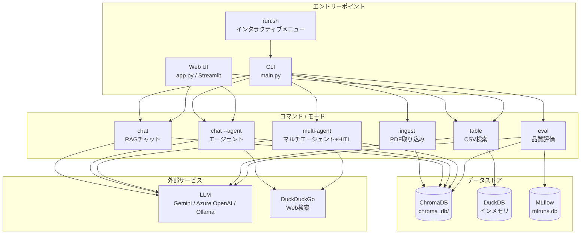
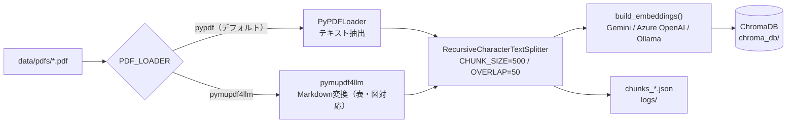
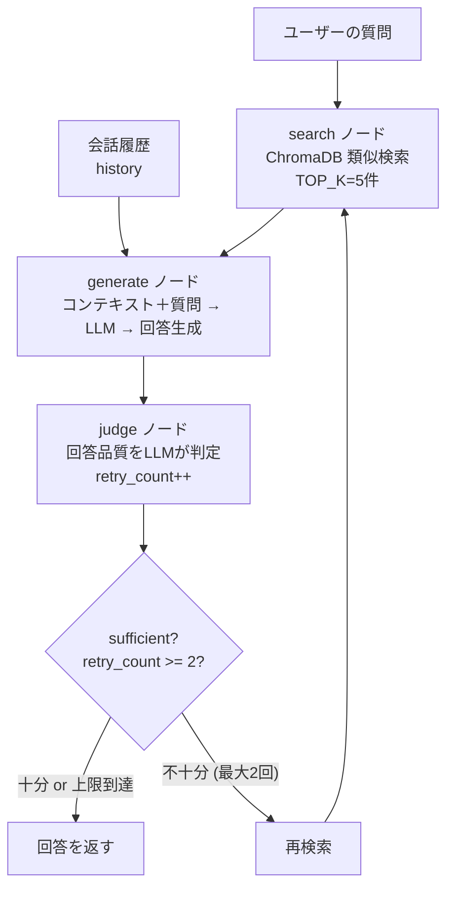
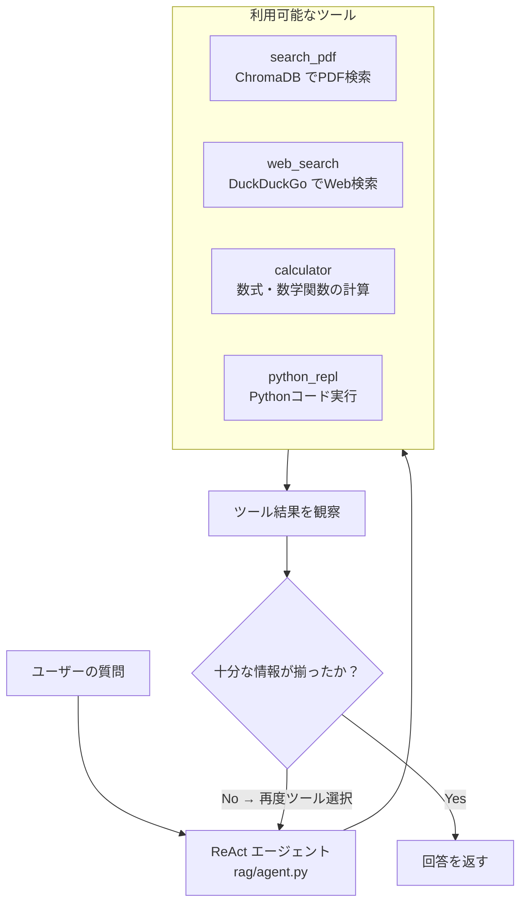
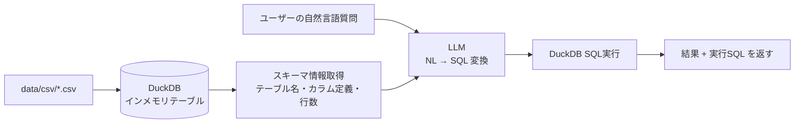
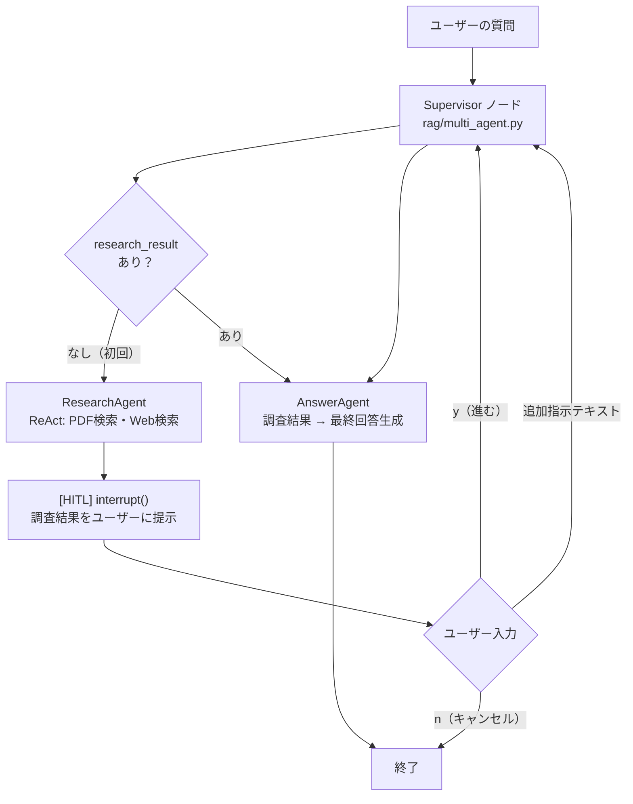
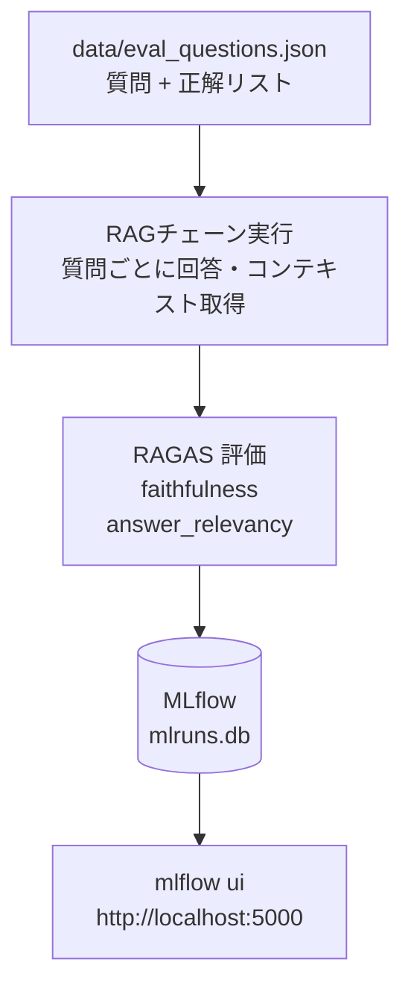

# フロー図 — study-rag

> 内部設計仕様は [docs/SPEC.md](SPEC.md) を参照。

## 全体アーキテクチャ

---

## 1. 取り込みフロー（ingest）

---

## 2. RAGチャットフロー（chat）

---

## 3. エージェントフロー（chat --agent）

---

## 4. テーブル検索フロー（table）

---

## 5. マルチエージェントフロー（multi-agent）

---

## 6. 評価フロー（eval）

